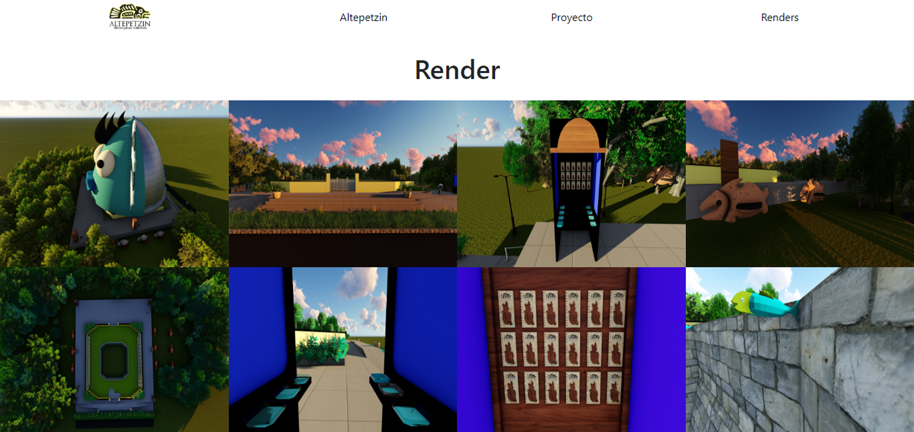

# Altepetzin-
Se retomó la esencia de los baños de Moctezuma para dar una nueva imagen y con énfasis en el mestizaje, se realizará una modificación en el sitio para desarrollar una intervención interactiva, asi mismo proyectar animaciones las cuales narrarán el uso de los Baños de Moctezuma en diferentes épocas hasta la actualidad. Así el público al que va dirigido podrá conocer un poco más de dicho sitio y su valor histórico

#### este proyecto será en secciones no one page*
# Proyecto Altepetzin

## Primer sección
### Inicio (Pagina de home)
  
 
  - Menú
   - Logotipo      Institucional Altepetzin
    - (Home logotipo, Altepetzin, Renders, Mapa.) (botones Negros, fondo blanco) *Position Fixed*
  - (Header) 
    - Carrusel Imgenes del Proyecto maximo 10 **espacio, artefactos**
  - (Section) 
    - Descripción: Concepto / imagen (imagen Anuncio) **esta seccion será dividida en dos partes divididas en 8 y 4 col)**
  - Descripción del Proyecto
  y signos de valor

    -Estudiantes 
    Angel yebrin, Rodrigo Rodriguez.
    - (mapa del lugar)  width: vh 100, heigth: auto;
  - footer: 
    - contactos, redes sociales.
    
  - ## Render
  - Menú
   - Logotipo      Institucional Altepetzin
    - (Home logotipo, Altepetzin, Proyecto, Mapa.) (botones Negros, fondo blanco) *Position Fixed*
  - (Header) 
  - Heroscreen: dividido en 4 secciones de 3 col 
donde se ubicarán cada uno de los artefactos y el espacio final montado con y sin cupula
  - ## Proyecto
   - Menú
   - Logotipo      Institucional Altepetzin
    - (Home logotipo, Altepetzin, Renders, Mapa.) (botones Negros, fondo blanco) *Position Fixed*
  - Heroscreen video logo reveal
  -Section : video de recorrido del espacio ccon cupula montada
  -section:
video recorrido del espacio sin cupula 

<!-- - photos Ej.:  -->
  - photos Ej.:  
  - photos Ej.: 
  - photos Ej.: 